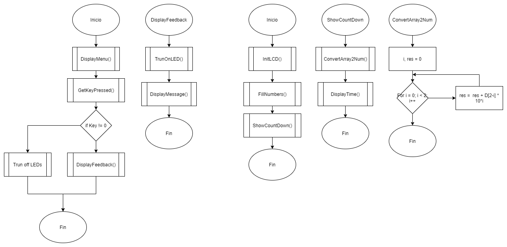
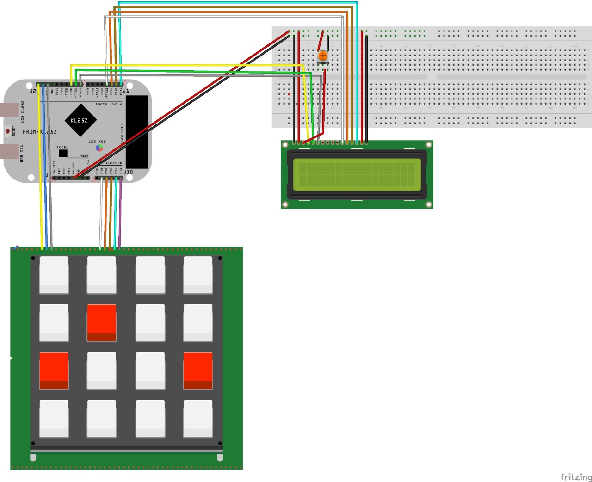

# Práctica 3:

## Part 1. Menu and output management. 
Write a very simple program that displays the following message in the LCD screen

            PRESS BUTTON

    R: 1           B: 2            G: 3

 

Then write a function that recovers the data from the get_key() function (plus a decoder) and switch on a led depending on which key was pressed (1: Red, 2: Blue, 3: Green) and display

    RED/BLUE/GREEN

        LED IS ON!

The led should remain on for a few seconds, then go off and display the initial menu again.

## Part 2: Ascending timer: 

The goal of the program is to implement a simple timer, as the ones used in sports or music. The code should proceed as follows:

1. It should print a hello and stay there for 5 seconds (you can use simple delay for this), then a second message should appear in the first line asking for the user to introduce the number of seconds.
1. To make this interesting, the code should be able to accept at least two digits, so you need to introduce the get_key(function) into a while loop that only stops when you press another not numerical key (for instance the * or # key.)
1. The introduced value should set the TMP_MODULO register in one timer and start it, either immediately after the termination key was selected or by pressing the same key again.
1. Then the LCD should show a message Counting and showing the current count value.
1. Once the timer has elapsed, you can use a buzzer (if you have it) or a led to mark that the timer went to zero.

## Flowchar of the code: 

## Connections:
Red cables represent 5V
Black cables reversent earth
### LCD
RS: PTA RW: PT4 EN: PTA5
D7 -> PTD7
D6 -> PTD6
D5 -> PTD5
D4 -> PTD4

### Keypad
PTC 0 -> Row1
...
PTC 7 -> Col8

Video: 