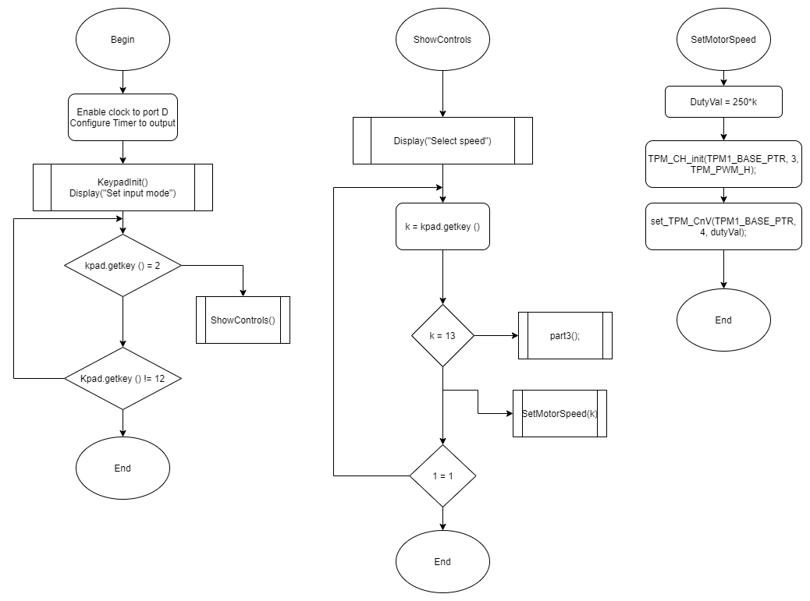

# PWM Configuration

Requires the use of a timer

ClkCount = CL_PSC/ PSC + 1

DutyCycle = CCR/(ARR + 1)
Period = (1 + ARR) * Clock Period

## Modes of operation:

### Up-counting

Counts from 0 to the number specified in the *Auto Reload Value* (ARR). Once it overflows, returns to 0. While at 0, a 1 value will be outputed on the *Count overflow Update event* (UEV)
### Down-counting

Counts from (ARR) to 0. Once it overflows, returns to ARR. While at ARR, a 1 value will be outputed on the (UEV)
    

### Cemter aligned mode

It swithes between up-counting and down-counting mode. While at ARR (up-counting) or 0 (down-counting), a 1 value will be outputed on the (UEV).
Duty Cycle = 1- (CCR/ARR)
Period = 2 * ARR * CLk period
Since signals are simetrical, they reduce noice and power consumption

### Edge aligned (Mode 1)

The UEV signal is set to 0  when the timer overflow

### High True (Mode 2)

The inverse mode for left aligned 

### Timer registers:

TPMSRC bits and the PLLFLLSEL bit of SIM_SOPT2 register in System Integration Module.

| Name                       | What it's for         | Notes|
|----------------------------|-----------------------|------|
| Compare & Capture register (CCR#) | Sends 1 when the count has reached a minimum value | If CAPTURE, you can select rising, falling or both edges to detect external events. Compare lets you have longer dut cycles. |
| Timer Output (OCREF)       | The actual PWM pulse  |Is configured by ARR, CCR & RCR|
| TIIMxCCER                  | Configure output polarity | With CCxP |

## Important notes:

A single timer can have more than 1 CCR. If configured like this, the'll have the same timer, prescaler and Reload value.

## Connections

## Flow diagram for part 3

